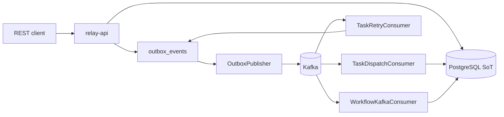

# Relay

Durable, dependency-aware workflow orchestration. **PostgreSQL** is the source of truth; **Kafka** carries task dispatch, delayed retries, and lifecycle events through a transactional outbox (no fire-and-forget past the database).

## What it does

- Submit a DAG over REST; Relay schedules ready tasks from dependency graphs
- Claims work with Postgres row locks (`FOR UPDATE SKIP LOCKED`)
- Retries with exponential backoff + jitter; exhausted tasks go to a DLQ with replay
- Outbox-drained Kafka topics: `relay.workflow.tasks`, `relay.workflow.tasks.retry`, `relay.workflow.events`
- Operator APIs for audit, dead-letter replay, dispatch failures, health, and metrics



## Tech stack

- Java 21, Maven multi-module (`api`, `core`)
- Spring Boot 3.4, Spring Data JPA, Flyway
- PostgreSQL + Kafka (Compose)
- Micrometer / Actuator

## Quickstart

Prerequisites: Java 21, Maven 3.9+, Docker.

```bash
export JAVA_HOME=/opt/homebrew/opt/openjdk@21/libexec/openjdk.jdk/Contents/Home
cp .env.example .env

# Postgres + API (Kafka off by default in Compose app profile)
KAFKA_ENABLED=false docker compose --profile app up -d --build

# Postgres + Kafka + API orchestrator + consume-only worker
KAFKA_ENABLED=true docker compose --profile distributed up -d --build
```

Health: `curl -s http://localhost:8080/api/actuator/health`

Submit a workflow:

```bash
curl -X POST http://localhost:8080/api/workflows \
  -H "Content-Type: application/json" \
  -d '{
    "tasks": [
      {"id": "task-a", "type": "success"},
      {"id": "task-b", "type": "success", "dependsOn": ["task-a"]}
    ]
  }'
```

```bash
mvn test
./scripts/kafka-smoke.sh   # distributed + Kafka-off rollback when Docker is up
./scripts/benchmark.sh     # writes docs/benchmarks.md when Docker is up
```

## Operator APIs

```bash
curl http://localhost:8080/api/dead-letters
curl -X POST http://localhost:8080/api/dead-letters/<id>/replay
curl http://localhost:8080/api/dispatch-failures
curl http://localhost:8080/api/actuator/health
curl http://localhost:8080/api/actuator/metrics
```

## Configuration

| Variable | Default | Meaning |
| --- | --- | --- |
| `KAFKA_ENABLED` | `true` (host) / Compose profile-specific | Kafka publishers/listeners + outbox drain |
| `WORKER_ORCHESTRATION_ENABLED` | `true` | When `false`, process only consumes Kafka tasks |
| `KAFKA_BROKERS` | `localhost:9092` | Bootstrap servers |
| `KAFKA_TASK_TOPIC` | `relay.workflow.tasks` | Task dispatch topic |
| `KAFKA_TASK_RETRY_TOPIC` | `relay.workflow.tasks.retry` | Delayed retry topic |
| `KAFKA_TOPIC` | `relay.workflow.events` | Lifecycle events topic |
| `RETRY_BACKOFF_ENABLED` | `true` | Exponential backoff + jitter |
| `RETRY_MAX_ATTEMPTS` | `3` | Max attempts before DLQ |
| `TASK_CLAIM_LEASE_SECONDS` | `300` | Execution lease duration |
| `TASK_CLAIM_SKIP_LOCKED` | `true` | Postgres `SKIP LOCKED` claims |
| `OUTBOX_POLL_DELAY` | `1000` | Outbox drain interval (ms) |
| `OUTBOX_MAX_ATTEMPTS` | `8` | Publish attempts before outbox `FAILED` |
| `WORKER_MAX_CONCURRENCY` | `4` | Worker concurrency |

## Docs

- [Architecture](docs/architecture.md)
- [Runbook](docs/runbook.md)
- [Kafka contract](docs/kafka-contract.md)
- [Kafka runbook](docs/kafka-runbook.md)
- [Phase IX status (COMPLETE)](docs/phase-ix.md)
- [Benchmarks](docs/benchmarks.md)

## Resume talking points (tested)

1. Concurrent claim path: two claimers cannot both receive `CLAIMED` for the same ready task (`KafkaReliabilityTest` / Postgres IT).
2. Duplicate delivery of a succeeded task is a no-op (single attempt; adapters skip `ALREADY_COMPLETE`).
3. Dispatch/retry/lifecycle messages are written to `outbox_events` in the same transaction as state changes before broker publish; DLQ replay requeues safely.

## Troubleshooting

- **Java 26 vs 21**: set `JAVA_HOME` to OpenJDK 21 before `mvn`.
- **Tasks stuck RUNNING**: lease recovery returns expired claims to `PENDING`.
- **No consume**: confirm `OutboxPublisher` marks rows `PUBLISHED`; check `/api/dispatch-failures`.
- **Duplicate idempotency_key**: submit rejected while a non-terminal task holds the key.

## License

See `LICENSE`.
