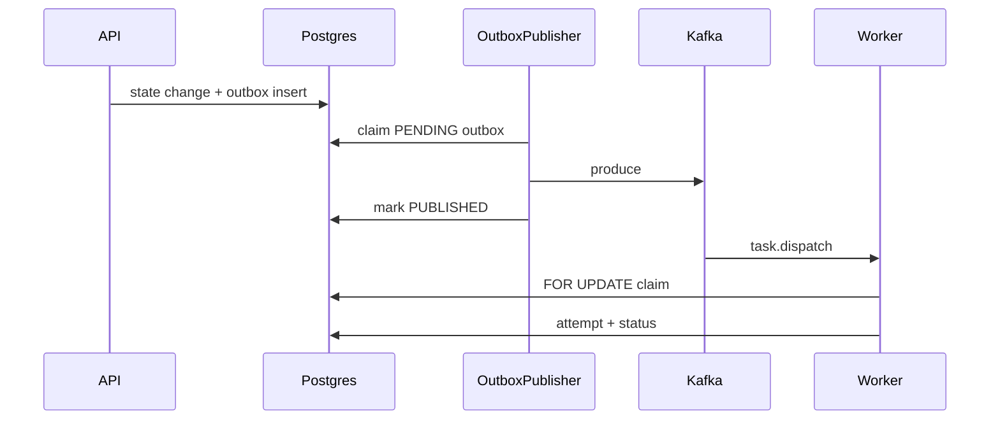

# Relay architecture (v1.0)

## Source of truth

**PostgreSQL** stores workflows, tasks, attempts, dead letters, outbox rows, idempotency outcomes, and optional event projections. Kafka never replaces Postgres for workflow state.

## Runtime paths

### In-process (Kafka disabled)

1. REST submit → `WorkflowOrchestrator` persists the graph.
2. `WorkflowWorker` polls PENDING/RUNNING workflows.
3. Ready tasks (dependencies satisfied, `next_attempt_at` elapsed) are claimed via `TaskExecutionGuard` / `TaskClaimService` (`FOR UPDATE`, with `SKIP LOCKED` on Postgres).
4. Adapters execute; retries schedule `next_attempt_at` using exponential backoff + jitter; exhaustion writes `dead_letter_tasks`.

### Distributed (Kafka enabled)

1. Ready tasks transition to `QUEUED` and an `outbox_events` row is written in the **same transaction**.
2. `OutboxPublisher` polls unpublished rows (`SKIP LOCKED` when available) and produces to Kafka.
3. `TaskDispatchConsumer` claims before side effects; duplicate / already-complete deliveries are no-ops. After success it continues the DAG by calling `WorkflowOrchestrator` (queues newly ready dependents through the outbox).
4. `WorkflowKafkaConsumer` projects lifecycle events into Micrometer counters and `workflow_event_projections` (telemetry only).
5. Consume-only workers (`WORKER_ORCHESTRATION_ENABLED=false`) join `relay-workflow-task-group`. Topics default to 12 partitions so 1→N workers actually load-balance.

## Claiming and leases

| Column | Role |
| --- | --- |
| `execution_claimed_at` | Claim timestamp |
| `locked_by` | Worker identity |
| `lease_expires_at` | Soft lease expiry |
| `next_attempt_at` | Retry not-before |

Expired RUNNING / stale QUEUED rows are returned to PENDING by `TaskLeaseRecoveryService`.

## Idempotency

- Skip execution when status is SUCCEEDED/DEAD_LETTERED or an `idempotency_outcomes` row exists.
- Claim decision `ALREADY_COMPLETE` means adapters must not re-apply side effects.
- Submit rejects a duplicate `idempotency_key` while another non-terminal task holds it.

## Outbox contract

`outbox_events(id, aggregate_type, aggregate_id, event_type, payload, created_at, published_at, status)`

Event types:

- `workflow.event` → `relay.kafka.topic`
- `task.dispatch` → `relay.kafka.task-topic`

## Modules

- `core` — domain, repositories, orchestration, Kafka/outbox services
- `api` — REST, Flyway, Actuator, Spring Boot entrypoint
